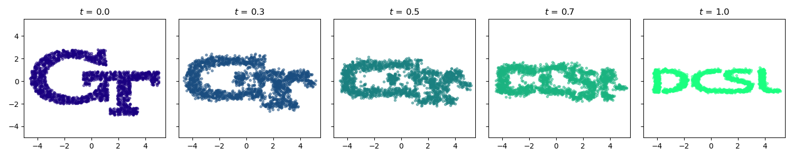
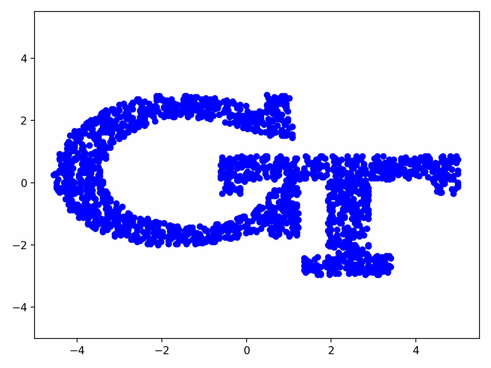
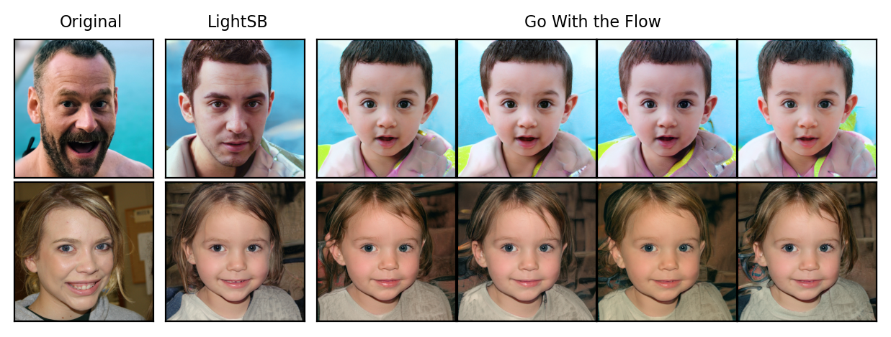

This is a pytorch implementation of GMMflow, the algorithm introduces in our recent work [**Go With the Flow: Fast Diffusion for Gaussian Mixture Models**](https://arxiv.org/abs/2412.09059)
by [George Rapakoulias](https://scholar.google.com/citations?user=f-2iPeYAAAAJ&hl=en), [Ali Reza Pedram](https://scholar.google.com/citations?user=OIFfnsEAAAAJ&hl=en&oi=ao) and [Panagiotis Tsiotras](https://scholar.google.com/citations?user=qmVayjgAAAAJ&hl=en&oi=ao)

**GMMflow** is a lightweight solver for the Schrodinger Bridge problem for the special case where the boundary distributions are Gaussian Mixture Models. 
Instead of relying on expensive neural networks training schemes, **GMMflow** proposes a closed form parametrization of the SDE drift to maps an initial GMM to a terminal one. 
The optimal values of the parameters can be evaluated efficiently by solving a linear program. 
We illustrate our approach in a variety of benchmarks and problems, ranging from low-dimensional toy problems to Image translation problems in the latent space of an autoencoder. 

In the image translation example, we used the setup of [LightSB](https://github.com/ngushchin) and parts of their setup code for the [ALAE autoencoder](https://github.com/podgorskiy/ALAE).


<div align="center">
     &ensp; 
</div>


<div align="center">
    
</div>_


Cite as 
```
@article{rapakoulias2024go,
  title={Go With the Flow: Fast Diffusion for Gaussian Mixture Models},
  author={Rapakoulias, George and Pedram, Ali Reza and Tsiotras, Panagiotis},
  journal={arXiv preprint arXiv:2412.09059},
  year={2024}
}
```