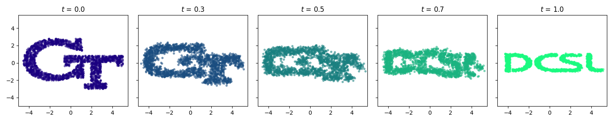
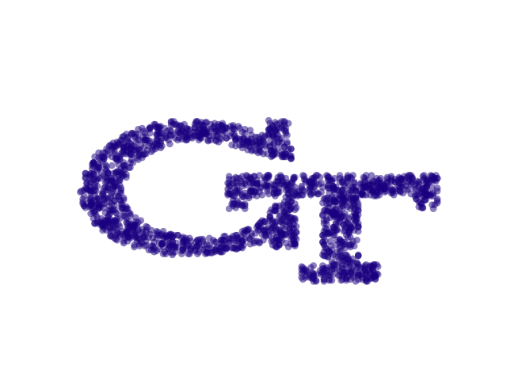

# [NeurIPS 2025 Spotlight] Go With The Flow: Fast Diffusion for Gaussian Mixture Models 

Official PyTorch implementation of the paper [*Go With the Flow: Fast Diffusion for Gaussian Mixture Models*](https://arxiv.org/abs/2412.09059)
by [George Rapakoulias](https://scholar.google.com/citations?user=f-2iPeYAAAAJ&hl=en), [Ali Reza Pedram](https://scholar.google.com/citations?user=OIFfnsEAAAAJ&hl=en&oi=ao), [Fengjiao Liu](https://scholar.google.com/citations?user=rsRZzMwAAAAJ&hl=en&oi=ao), [Lingjiong Zhu](https://scholar.google.com/citations?user=Z9JkFaoAAAAJ&hl=en&oi=ao) and [Panagiotis Tsiotras](https://scholar.google.com/citations?user=qmVayjgAAAAJ&hl=en&oi=ao)

**GMMflow** is a lightweight Schrodinger Bridge/OT solver for problems with Gaussian Mixture Model boundary distributions. 
Instead of relying on expensive neural networks training schemes, **GMMflow** proposes a closed form parametrization of an SDE drift that maps an initial GMM to a terminal one. 
The optimal values of the parameters can be approximated efficiently by solving a linear program. 
Due to its control-theoretic formulation, it generalizes naturally to more complicated transport problems, such as the multi-marginal momentum Schrodinger Bridge, or problems with general linear prior dynamics. 
In the image translation example, we used the setup of [LightSB](https://github.com/ngushchin) and parts of their setup code for the [ALAE autoencoder](https://github.com/podgorskiy/ALAE).


<div align="center">
     
</div>

<div align="center">
    
</div>

<div align="center">
    
</div>_


Cite as 
```
@article{rapakoulias2024go,
  title={Go With the Flow: Fast Diffusion for Gaussian Mixture Models},
  author={Rapakoulias, George and Pedram, Ali Reza and Tsiotras, Panagiotis},
  journal={arXiv preprint arXiv:2412.09059},
  year={2024}
}
```